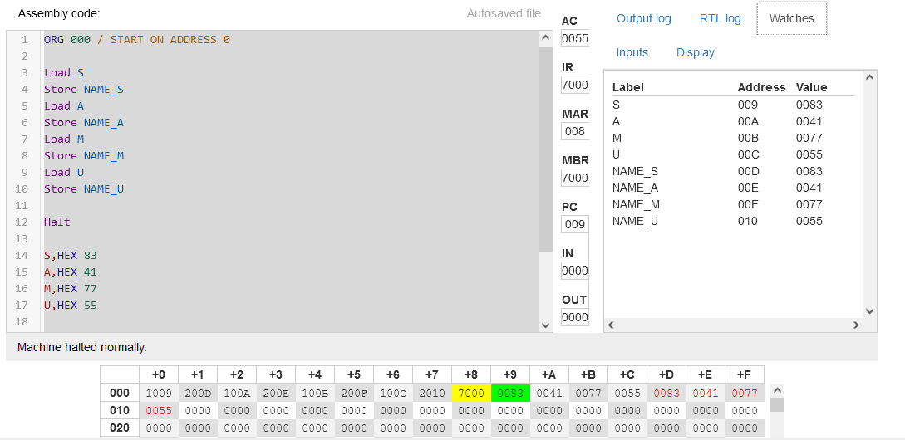

# Alocação de Memória

**Explicação:**

como funciona a alocação de memória dinamica para armazenar o nome, explicar AC IR MAR etc.

1. `ORG 000 / START ON ADDRESS 0`: Define o ponto de origem do programa para o endereço 0.
2. `Load S`: Carrega o valor contido na variável `S`.
3. `Store NAME_S`: Armazena o valor carregado na variável `NAME_S`.
4. `Load A`: Carrega o valor contido na variável `A`.
5. `Store NAME_A`: Armazena o valor carregado na variável `NAME_A`.
6. `Load M`: Carrega o valor contido na variável `M`.
7. `Store NAME_M`: Armazena o valor carregado na variável `NAME_M`.
8. `Load U`: Carrega o valor contido na variável `U`.
9. `Store NAME_U`: Armazena o valor carregado na variável `NAME_U`.
10. `Halt`: Encerra a execução do programa.

Após o `Halt`, o programa não executa mais nenhuma instrução. As linhas abaixo do `Halt` definem as variáveis com seus respectivos valores em hexadecimal. Essas definições não têm efeito após o `Halt`, pois o programa encerrou sua execução.

# [Hello World](C:\Users\samue\OneDrive\Documentos\projects\assembly\print.asm)

